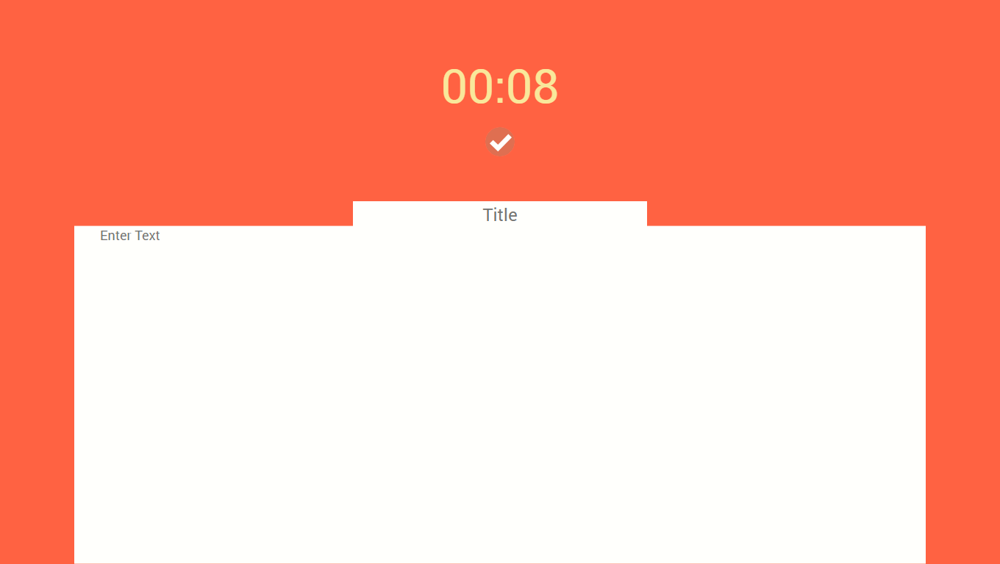

# Note Timer
> A simple app note with recording time.

## Table of contents
* [General info](#general-info)
* [Screenshots](#screenshots)
* [Technologies](#technologies)
* [Link](#link)
* [Features](#features)
* [Status](#status)
* [Inspiration](#inspiration)
* [Contact](#contact)

## General info
Add more general information about project. What the purpose of the project is? Motivation?

## Screenshots

## Technologies
* HTML CSS JS 

## Link
[Note Timer]( https://filicaliva.github.io/work_timer/)

## Status
Project is: _finished_

## Contact
Created by [@filicaliva](https://www.linkedin.com/in/vfilimonchuk/) - feel free to contact me!